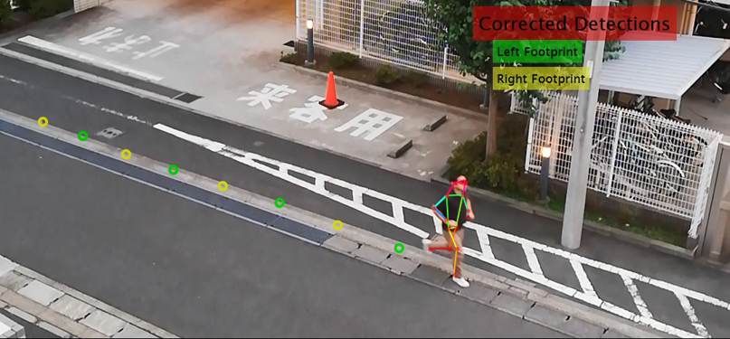

# Stride measurement of a runner
# ランナーの歩幅計測


This sample script is to measure the stride of a runner in video by using deep learning model and simple signal processing.


このサンプルスクリプトでは、ディープラーニングモデルと簡単な信号処理を組合わせて、ビデオ中のランナーの歩幅を計測する方法を示します。


# Pre-requisites
# 動作環境

   -  MATLAB 2020a 
   -  Image Processing Toolbox 
   -  Computer Vision Toolbox 
   -  Deep Learning Toolbox 


You need a Human Pose Estimation Network. Download [this repository](https://github.com/matlab-deep-learning/Human-Pose-Estimation-with-Deep-Learning) and set the path to the project. In detail, see [the repository](https://github.com/matlab-deep-learning/Human-Pose-Estimation-with-Deep-Learning).


[Japanese]このサンプルを動かすためには姿勢推定のネットワークモデルが必要となります。[こちらのリポジトリ](https://github.com/matlab-deep-learning/Human-Pose-Estimation-with-Deep-Learning)からダウンロードし、リポジトリへのパスを設定しておいてください。詳細は[リポジトリのページ](https://github.com/matlab-deep-learning/Human-Pose-Estimation-with-Deep-Learning)をご覧ください。


# Getting Started
# サンプルデモを試す


First, open the project file


[Japanese]始めにプロジェクトファイルを開いてください。


```matlab:Code
open Stride_measurement_of_runner.prj;
```


This sample code requires a pretrained YOLOv3 network for detecting person from an image. Follow "src/YOLOv3/tb_darknet2yolo_mat.mlx" to get the pretrained YOLOv3 network.


[Japanese]このサンプルコードは、画像から人物を検出するために学習済みのYOLOv3ネットワークを必要とします。"src/YOLOv3/tb_darknet2yolo_mat.mlx"を実行して学習済みのYOLOv3ネットワークを準備してください。


```matlab:Code
open tb_darknet2yolo_mat.mlx; % and execute mlx
```


To run the main script, run "src/stride_measurement_of_runner.mlx".


[Japanese]メインスクリプトは"src/stride_measurement_of_runner.mlx"です。これを開いて実行してください。


```matlab:Code
open Stride_measurement_of_runner.mlx;
```

# Resulted Video
# 処理結果のビデオ


The resulted video processed by the script above will be found at "data/processed/". 


[Japanese]上のスクリプトで処理した結果のビデオは"data/processed/"にあります。





# Documents


The powerpoint file are saved in "docs/".


[Japanese]パワーポイントファイルは"docs/"フォルダに保存しています。


Copyright 2020 The MathWorks, Inc.


